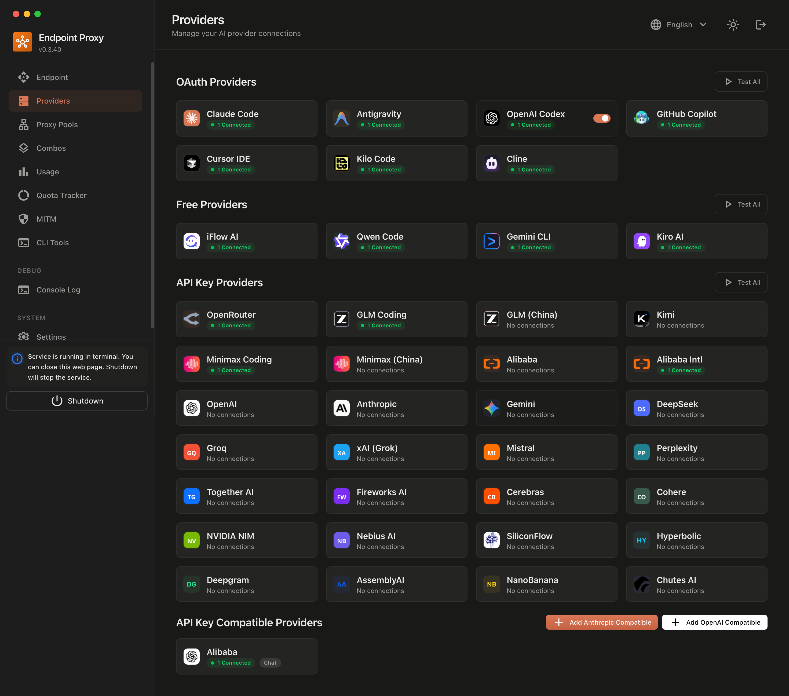

# Hướng Dẫn Tiếng Việt

<div align="center">
  
</div>

## Cài đặt nhanh

### Bước 1: Cấu hình `config.toml`

Trên Windows, truy cập vào:
`C:\Users\<tên thư mục người dùng>\.codex`

Tìm file `config.toml`, mở file này để chỉnh sửa.

Xóa toàn bộ nội dung cũ và dán cấu hình bên dưới, sau đó lưu lại:

```toml
model = "cx/gpt-5.4-xhigh"
model_provider = "KenDev-API"
sandbox_mode = "danger-full-access"

# Available KenDev-API models:
# cx/gpt-5.4
# cx/gpt-5.4-xhigh
# cx/gpt-5.4-high
# cx/gpt-5.3-codex
# cx/gpt-5.3-codex-xhigh
# cx/gpt-5.3-codex-high
# cx/gpt-5.3-codex-low
# cx/gpt-5.3-codex-none
# cx/gpt-5.3-codex-spark
# cx/gpt-5.2-codex
# cx/gpt-5.2
# cx/gpt-5.1-codex-mini
# cx/gpt-5.1-codex-mini-high
# cx/gpt-5.1-codex-max
# cx/gpt-5.1-codex
# cx/gpt-5.1
# cx/gpt-5-codex
# cx/gpt-5-codex-mini

[model_providers.KenDev-API]
name = "KenDev-API"
base_url = "http://14.225.255.58:20128/v1"
wire_api = "responses"

[agents.subagent]
model = "cx/gpt-5.3-codex-xhigh"

[windows]
sandbox = "unelevated"
```

### Bước 2: Cấu hình `auth.json`

Truy cập:
`C:\Users\<tên thư mục người dùng>\.codex`

Tìm file `auth.json`, xóa toàn bộ nội dung cũ và dán nội dung sau:

```json
{
  "auth_mode": "apikey",
  "OPENAI_API_KEY": "<your key>"
}
```

Lưu file lại.

## Hướng dẫn thay đổi model và mode của Codex

Muốn thay đổi model, vào `Settings` rồi mở `Config` để mở file `config.toml`.

Tại đây, copy một model trong danh sách `Available KenDev-API models` và thay vào dòng:

```toml
model = "..."
```

Các model có hậu tố `-xhigh`, `-high`, `-medium` là các model đã kèm sẵn mode tương ứng.

Với các model này, không cần và không nên đổi mode trong thanh chat với agent.

Lưu ý quan trọng: để tránh lỗi, tuyệt đối không thay hoặc chọn model ở thanh chat.

## Ghi chú

- Bạn có thể bị mất các cuộc trò chuyện cũ.
- Mở `VS Code -> Extensions`, cài `Codex`, và bảo đảm bạn đang dùng phiên bản mới nhất trước khi cấu hình.
- Sau khi cấu hình xong, hãy khởi động lại VS Code.

## Giới hạn

- Hiện tại subagent chưa hoạt động, nên công cụ chỉ chạy độc lập.
- Nếu muốn đổi model, hãy sửa dòng này trong `config.toml`:

```toml
model = "cx/gpt-5.4-xhigh"
```

## Các model hỗ trợ tốt

```txt
# cx/gpt-5.4
# cx/gpt-5.4-xhigh
# cx/gpt-5.4-high
# cx/gpt-5.3-codex
# cx/gpt-5.3-codex-xhigh
# cx/gpt-5.3-codex-high
# cx/gpt-5.3-codex-low
# cx/gpt-5.3-codex-none
# cx/gpt-5.3-codex-spark
# cx/gpt-5.2-codex
# cx/gpt-5.2
# cx/gpt-5.1-codex-mini
# cx/gpt-5.1-codex-mini-high
# cx/gpt-5.1-codex-max
# cx/gpt-5.1-codex
# cx/gpt-5.1
# cx/gpt-5-codex
# cx/gpt-5-codex-mini
```

## Điều hướng

- [Quay về trang chính](./README.md)
- [Xem bản tiếng Anh](./README.en.md)

